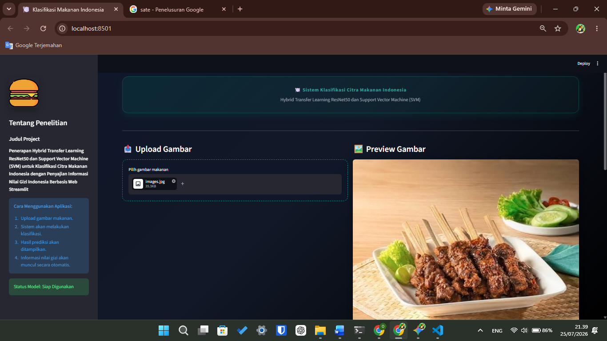
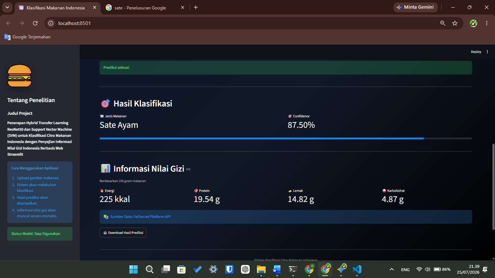
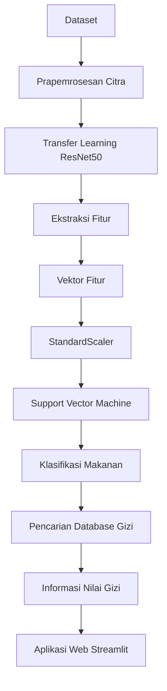
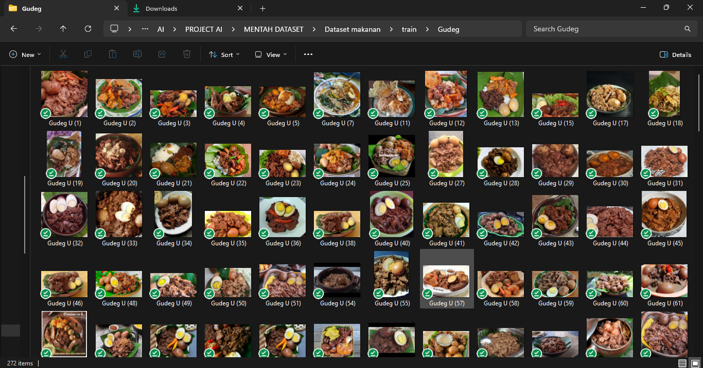

# 🍽️ Klasifikasi Citra Makanan Indonesia Menggunakan Hybrid Transfer Learning ResNet50 dan Support Vector Machine (SVM)


> Sistem klasifikasi citra makanan Indonesia berbasis web menggunakan **Streamlit** yang menerapkan pendekatan **Hybrid Deep Learning dan Machine Learning**, yaitu **ResNet50** sebagai ekstraktor fitur dan **Support Vector Machine (SVM)** sebagai pengklasifikasi. Aplikasi juga dilengkapi dengan fitur penampilan informasi nilai gizi secara otomatis berdasarkan hasil prediksi.

---

# 📖 Deskripsi

Proyek ini bertujuan untuk mengembangkan sistem klasifikasi citra makanan Indonesia berbasis web dengan menggabungkan teknik **Deep Learning** dan **Machine Learning**.

Model **ResNet50** digunakan sebagai **feature extractor** untuk memperoleh representasi fitur visual dari citra makanan. Selanjutnya, fitur-fitur tersebut diklasifikasikan menggunakan algoritma **Support Vector Machine (SVM)** sehingga mampu menghasilkan prediksi kategori makanan dengan tingkat akurasi yang tinggi.

Selain melakukan klasifikasi makanan, aplikasi ini juga secara otomatis menampilkan informasi kandungan gizi berdasarkan database nutrisi makanan Indonesia. Informasi yang disajikan meliputi kalori, protein, lemak, dan karbohidrat sehingga pengguna dapat mengetahui nilai gizi dari makanan yang diprediksi.

---

# 🖼️ Tampilan Aplikasi Streamlit

## Halaman Utama

> Tampilan awal aplikasi sebelum proses klasifikasi dilakukan.



---

## Hasil Prediksi dan Informasi Nilai Gizi

> Menampilkan hasil klasifikasi beserta tingkat kepercayaan (confidence score).



---

### 🎥 Live Demo / Workflow

> Proses klasifikasi interaktif mulai dari pengunggahan gambar hingga evaluasi nilai gizi.


---

# ✨ Fitur Utama

- 📤 Mengunggah citra makanan Indonesia
- 🤖 Klasifikasi otomatis menggunakan ResNet50 + Support Vector Machine
- 📊 Menampilkan nilai confidence hasil prediksi
- 🥗 Menampilkan informasi kandungan gizi makanan
- 🔥 Menampilkan kalori, protein, lemak, dan karbohidrat
- 💾 Mengunduh hasil prediksi
- 🌐 Antarmuka web yang interaktif menggunakan Streamlit

---

# 🧠 Metode yang Digunakan

## Deep Learning

- Transfer Learning
- ResNet50
- Feature Extraction

## Machine Learning

- StandardScaler
- Support Vector Machine (SVM)

---

## 🖼️ Diagram Alur Kerja Sistem



---

# ⚙️ Alur Kerja Sistem

Sistem bekerja melalui beberapa tahapan sebagai berikut:

1. Pengguna mengunggah citra makanan Indonesia melalui antarmuka aplikasi.
2. Sistem melakukan prapemrosesan (preprocessing) terhadap citra yang diunggah.
3. Model **ResNet50** mengekstraksi fitur-fitur visual dari citra.
4. Feature vector yang dihasilkan dinormalisasi menggunakan **StandardScaler**.
5. Model **Support Vector Machine (SVM)** melakukan klasifikasi berdasarkan feature vector tersebut.
6. Sistem mencari informasi kandungan gizi dari database nutrisi berdasarkan hasil prediksi.
7. Hasil prediksi beserta informasi nilai gizi ditampilkan kepada pengguna melalui aplikasi Streamlit.

---

# 📂 Struktur Proyek

```text
project/

├── STREAMLIT NUTRITION/
│   ├── app.py
│   └── run.bat
│
├── DATASET/
│   └── indonesian_food_nutrition_database.xlsx
│
├── MODELS/
│   ├── svm_model.pkl
│   ├── scaler.pkl
│   └── class_indices.pkl
│
├── IMAGES/
│   ├── home.png
│   ├── prediksi.png
│   ├── gizi.png
│   ├── pipeline.png
│   ├── architecture.png
│   ├── dataset.png
│   └── output.png
│
├── requirements.txt
└── README.md
```

---

# 🛠️ Teknologi yang Digunakan

Proyek ini dikembangkan menggunakan beberapa teknologi dan pustaka berikut:

- 🐍 Python
- 🌐 Streamlit
- 🔥 PyTorch
- 🧠 TIMM (PyTorch Image Models)
- 🖼️ ResNet50
- 🤖 Scikit-learn
- 📊 Support Vector Machine (SVM)
- 🐼 Pandas
- 🔢 NumPy
- 🖼️ Pillow

---

# 📊 Dataset

Dataset yang digunakan dalam penelitian ini merupakan kumpulan citra makanan Indonesia yang diperoleh dari beberapa sumber untuk mendukung proses klasifikasi.

## Sumber Dataset

- **Dataset Citra Makanan Indonesia (Kaggle)**

  https://www.kaggle.com/datasets/putriayusalsabila/datasetpenelitian

- **Referensi Data Nilai Gizi**

  https://www.fatsecret.co.id/

Informasi kandungan gizi yang digunakan meliputi:

- 🔥 Kalori (Energi)
- 🥩 Protein
- 🧈 Lemak
- 🍚 Karbohidrat

---

## 🖼️ Contoh Dataset



---

# 📋 Output Sistem

Setelah proses klasifikasi selesai, aplikasi akan menampilkan informasi sebagai berikut:

- 🍽️ Nama makanan hasil prediksi
- 📊 Confidence Score
- 🔥 Kalori
- 🥩 Protein
- 🧈 Lemak
- 🍚 Karbohidrat

---

# 🚀 Memulai Proyek

## 1. Clone Repository

```bash
git clone https://github.com/username/project.git
```

---

## 2. Masuk ke Direktori Proyek

```bash
cd project
```

---

## 3. Instal Seluruh Dependensi

```bash
pip install -r requirements.txt
```

---

## 4. Jalankan Aplikasi Streamlit

```bash
streamlit run app.py
```

Setelah aplikasi dijalankan, browser akan terbuka secara otomatis dan sistem siap digunakan.

---

# 💻 Lingkungan Pengembangan

Proyek ini dikembangkan menggunakan:

- Google Colab
- Visual Studio Code
- Google Drive
- Streamlit

---

# 👨‍💻 Pengembang

## Yogi Irawan

🎓 Mahasiswa Program Studi Informatika

🤖 Bidang Minat:
Artificial Intelligence, Computer Vision, Deep Learning, dan Machine Learning.

📧 Email

yogiirawan490@gmail.com

💼 LinkedIn

https://www.linkedin.com/in/yogi-irawan-ab146a387

🐙 GitHub

https://github.com/username

---

# 🤝 Kontribusi

Kontribusi terhadap proyek ini sangat terbuka.

Apabila Anda menemukan bug, memiliki saran pengembangan, atau ingin menambahkan fitur baru, silakan membuat **Issue** maupun **Pull Request** pada repository ini.

---

# ⭐ Dukungan

Apabila proyek ini bermanfaat, jangan lupa memberikan ⭐ pada repository GitHub ini sebagai bentuk dukungan terhadap pengembangan proyek.

---

# 📄 Lisensi

Proyek ini dirilis di bawah lisensi **MIT License**.

Copyright (c) 2026 **Yogi Irawan**
